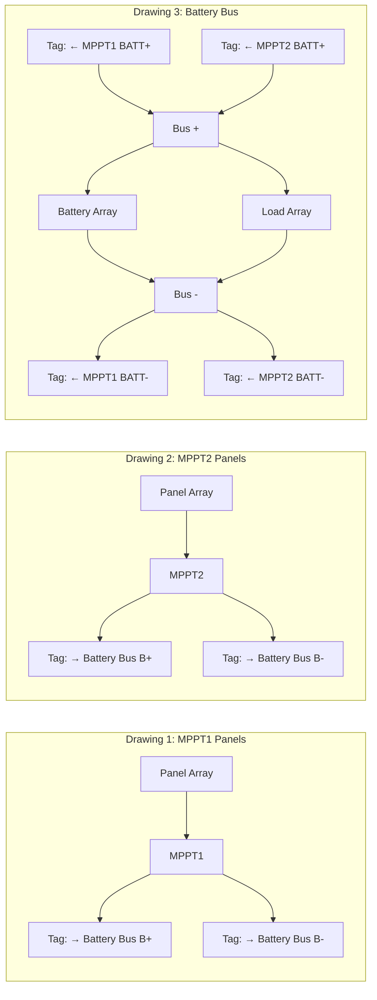

# Implementation Plan — Dynamic Electrical Drawing System

## Problem Statement

Create a dynamic, scalable electrical drawing system that generates multi-page schematics from JSON configuration files. The system splits the circuit into per-MPPT panel drawings and a shared battery/load bus drawing, connected via bidirectional `Tag` pointers. Each drawing fits on a single page.

## Requirements

- Per-MPPT drawings: each MPPT+panel config generates individual drawings based on `count`
- Battery bus drawing: shared drawing with bus bar connecting all MPPT outputs, battery array, and load array
- Bidirectional Tag pointers between drawings (e.g., `→ Battery Bus B+` / `← MPPT1 BATT+`)
- All arrays have 2 terminals; MPPT has 4 terminals
- Page-fitted: each drawing scaled to fit A4 without scrolling
- Output: combined multi-page PDF + subfolder with individual SVGs
- Config-driven from existing JSON files
- Makefile: `make electrical-drawing BOAT=rp2` or `make electrical-drawing` for all boats

## Background

- schemdraw `Tag(label='...')` provides net-label style cross-references
- `Drawing.config(unit=N)` controls sizing; matplotlib `fig.set_size_inches()` handles page fitting
- `matplotlib.backends.backend_pdf.PdfPages` compiles multi-page PDFs
- Existing `draw_array()` handles series/parallel layout with configurable terminal distance
- Existing `MPPT` component has 4 anchors: PV+, PV-, BATT+, BATT-
- Panel series/parallel comes from `panel_info.in_series`/`in_parallel` (or fallback to `boat_params.panels_per_string`)
- rp2 has 2 MPPTs (config_1, count=2); rp3 has 3 MPPTs (config_1, count=3)

## Proposed Solution



## Architecture

```
src/electrical_drawing/
├── __main__.py                  CLI entry point (argparse)
├── drawing_generator.py         Orchestrator: config → drawings → output
├── page_scaler.py               Fits drawings to page dimensions
├── Array_Creator.py             Draws series/parallel arrays (refactored)
├── components/
│   ├── MPPT.py                  MPPT element (existing, updated)
│   ├── Load.py                  Load/Motor element
│   └── Battery.py               Battery element with labeling
├── drawings/
│   ├── mppt_panel_drawing.py    Generates one MPPT+panel sub-drawing
│   └── battery_bus_drawing.py   Generates the battery/load bus drawing
├── output/
│   └── pdf_compiler.py          Combines drawings into multi-page PDF
└── configurations/
    └── constants.py             Layout constants
```

## Task Breakdown

### Task 1: Refactor Array_Creator with structured terminal output

**Objective:** Rewrite `Array_Creator.draw_array()` to return structured terminal metadata and accept a label format.

**Implementation guidance:**
- Create a `TerminalPair` dataclass: `positive` (Point), `negative` (Point), `positive_label` (str), `negative_label` (str)
- Refactor `draw_array(drawing, element, series, parallel, terminateDist, isRight, label_prefix)` → returns `(drawing, TerminalPair)`
- `label_prefix` drives per-component labeling (e.g., `"B"` → `B1`, `B2`, ...)
- Add type hints throughout

**Test requirements:**
- Unit test: `TerminalPair` positions for 1s1p, 2s2p, 3s1p configurations
- Unit test: terminal gap equals `terminateDist`
- Unit test: label numbering is sequential

**Demo:** Script creates a 2s2p battery array, prints terminal positions and labels, confirming the structured return.

---

### Task 2: Create Battery and Load custom elements

**Objective:** Create `Battery.py` and `Load.py` as custom schemdraw elements usable in `draw_array()`.

**Implementation guidance:**
- `Battery`: wraps schemdraw's `elm.Battery` concept, adds configurable label (voltage, chemistry type). Two-terminal element with `start`/`end` anchors
- `Load`: rectangular body with label (motor name + power), styled similar to `elm.Motor`. Two-terminal with `start`/`end` anchors
- Both must be compatible as the `element` parameter to `draw_array()`

**Test requirements:**
- Unit test: Battery element anchors at expected relative positions
- Unit test: Load element anchors at expected relative positions
- Unit test: both pass through `draw_array()` for a 1s1p and 2s1p config without error

**Demo:** Standalone script draws a labeled 2s1p battery array ("25.9V LiNMC") and a 1s2p load array ("Torqeedo 4.0kW"), saved as test SVGs.

---

### Task 3: Build MPPT-Panel sub-drawing generator

**Objective:** Create `drawings/mppt_panel_drawing.py` that produces a complete panel → MPPT → Tag drawing for one MPPT instance.

**Implementation guidance:**
- Function: `generate_mppt_panel_drawing(mppt_index, panel_config, mppt_config, components, boat_params) → schemdraw.Drawing`
- Layout left-to-right: Panel array (using `elm.Solar`) → wires → MPPT (PV+/PV-) → BATT+/BATT- → Tag elements
- Tags: `elm.Tag(label='→ Battery Bus B+').right()` at MPPT BATT+ output, same for B-
- Panel series from `panel_config.in_series` (fallback: `boat_params.panels_per_string`), parallel from `panel_config.in_parallel` (fallback: derived from `panels_longitudinal * panels_transversal / panels_per_string`)
- MPPT labeled with index: "MPPT1", "MPPT2", etc.
- Title/header on drawing with MPPT name and panel spec

**Test requirements:**
- Unit test: drawing element count matches expected (series x parallel solar panels + MPPT + 2 Tags)
- Unit test: Tag labels contain correct MPPT index and "Battery Bus B+" / "Battery Bus B-"
- Unit test: works for different panel configs (1s2p vs 4s2p)

**Demo:** Generate MPPT1 and MPPT2 drawings from `rp3_circuit_setup.json`, save as SVGs showing 4s2p panel arrays connected to labeled MPPTs with output tags.

---

### Task 4: Build Battery Bus sub-drawing generator

**Objective:** Create `drawings/battery_bus_drawing.py` that generates the shared battery + load bus drawing with incoming MPPT Tags.

**Implementation guidance:**
- Function: `generate_battery_bus_drawing(circuit_config, components) → schemdraw.Drawing`
- Layout:
  - Left side: incoming Tags stacked vertically, one pair per MPPT (`← MPPT1 BATT+`, `← MPPT2 BATT+`, etc.)
  - Tags connect to horizontal bus lines (positive bus top, negative bus bottom) via `elm.Line` + `elm.Dot` at junctions
  - Center: Battery array connected between bus+ and bus-
  - Right: Load array connected between bus+ and bus- in parallel with battery
- Count total MPPTs by summing all `config_N.count` values
- Battery: `battery.battery_in_series` / `battery.battery_in_parallel` from config
- Loads: one load element per `load_N` entry, drawn as parallel array

**Test requirements:**
- Unit test: correct number of input Tags (2 per MPPT, total = 2 x sum of counts)
- Unit test: battery array matches config series/parallel
- Unit test: load count matches number of load entries in config

**Demo:** Generate battery bus drawing from `rp2_circuit_setup.json` — shows 2 pairs of input tags, bus bars, 2s1p battery array, and 1 load, saved as SVG.

---

### Task 5: Implement page scaling and PDF compilation

**Objective:** Build `page_scaler.py` to fit drawings to A4 and `output/pdf_compiler.py` to assemble multi-page PDF.

**Implementation guidance:**
- `page_scaler.py`:
  - `scale_to_page(drawing, page_width_inches=11.69, page_height_inches=8.27, margin_inches=0.5)` (A4 landscape)
  - Draw to matplotlib figure, get bounding box, compute scale factor, set figure size
  - Alternative: use schemdraw's `Drawing.config(unit=X)` to pre-scale based on estimated element count
- `output/pdf_compiler.py`:
  - `compile_pdf(drawings: list[schemdraw.Drawing], output_path: str)`
  - Uses `matplotlib.backends.backend_pdf.PdfPages`
  - Each drawing rendered to its own page at the scaled size
- Individual SVG export: `drawing.save(path)` for each sub-drawing

**Output structure:**
```
artifact/{boat}.electrical_drawing/
├── {boat}.electrical_drawing.pdf
└── pages/
    ├── {boat}.mppt1_panel.svg
    ├── {boat}.mppt2_panel.svg
    └── {boat}.battery_bus.svg
```

**Test requirements:**
- Unit test: scaled figure dimensions are within A4 bounds
- Unit test: PDF file is created with correct page count
- Integration test: output folder structure matches expected layout

**Demo:** Create 3 dummy drawings, scale them, compile into a 3-page PDF, and verify each page fits A4 landscape.

---

### Task 6: Wire up drawing_generator orchestrator and CLI with Makefile

**Objective:** Create `drawing_generator.py` orchestrator, rewrite `__main__.py` with argparse, and add Makefile target.

**Implementation guidance:**
- `drawing_generator.py`:
  1. `generate_all(circuit_path, components_path, boat_params_path, output_path)`
  2. Load and parse all JSON configs
  3. For each `config_N` in `mppt_panel`: loop `count` times, call `generate_mppt_panel_drawing()`
  4. Call `generate_battery_bus_drawing()` once
  5. Scale all drawings via `page_scaler`
  6. Save individual SVGs to `{output_path}/pages/`
  7. Compile all into `{output_path}/{boat}.electrical_drawing.pdf`

- `__main__.py`:
  ```python
  parser.add_argument('--circuit', required=True)
  parser.add_argument('--components', required=True)
  parser.add_argument('--boat-params', required=True)
  parser.add_argument('--output', required=True)
  ```

- Makefile addition:
  ```makefile
  # ==============================================================================
  # ELECTRICAL DRAWING
  # ==============================================================================

  ELECTRICAL_DRAWING_DIR := $(SRC_DIR)/electrical_drawing
  ELECTRICAL_DRAWING_ARTIFACT := $(ARTIFACT_DIR)/$(BOAT).electrical_drawing

  $(ELECTRICAL_DRAWING_ARTIFACT): $(ELECTRICAL_CIRCUIT_FILE) $(COMPONENT_FILES) $(ELECTRICAL_BOAT_PARAMS_FILE) | $(ARTIFACT_DIR)
  	@echo "Generating electrical drawing: $(BOAT)"
  	@$(PYTHON) -m src.electrical_drawing \
  		--circuit $(ELECTRICAL_CIRCUIT_FILE) \
  		--components $(COMPONENT_FILES) \
  		--boat-params $(ELECTRICAL_BOAT_PARAMS_FILE) \
  		--output $@
  	@echo "Electrical drawing complete: $@"

  .PHONY: electrical-drawing
  electrical-drawing: $(ELECTRICAL_DRAWING_ARTIFACT)
  	@echo "Electrical drawing completed for $(BOAT)"

  .PHONY: electrical-drawing-all
  electrical-drawing-all:
  	@for boat in $(BOATS); do \
  		$(MAKE) electrical-drawing BOAT=$$boat || true; \
  	done
  ```

**Test requirements:**
- Integration test: `python -m src.electrical_drawing --circuit ... --output ...` runs end-to-end and produces expected output
- Integration test: verify rp1 (2 MPPTs, 1 load), rp2 (2 MPPTs, 1 load), rp3 (3 MPPTs, 1 load) all generate correct page counts
- Unit test: config loading handles missing optional fields (e.g., missing `in_series` falls back to `panels_per_string`)

**Demo:** Running `make electrical-drawing BOAT=rp2` produces `artifact/rp2.electrical_drawing/rp2.electrical_drawing.pdf` (3 pages) and `artifact/rp2.electrical_drawing/pages/` with 3 SVGs. Running `make electrical-drawing` without BOAT generates for all boats.
