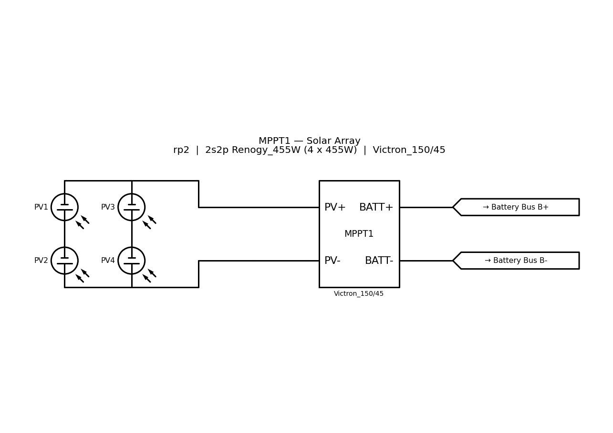
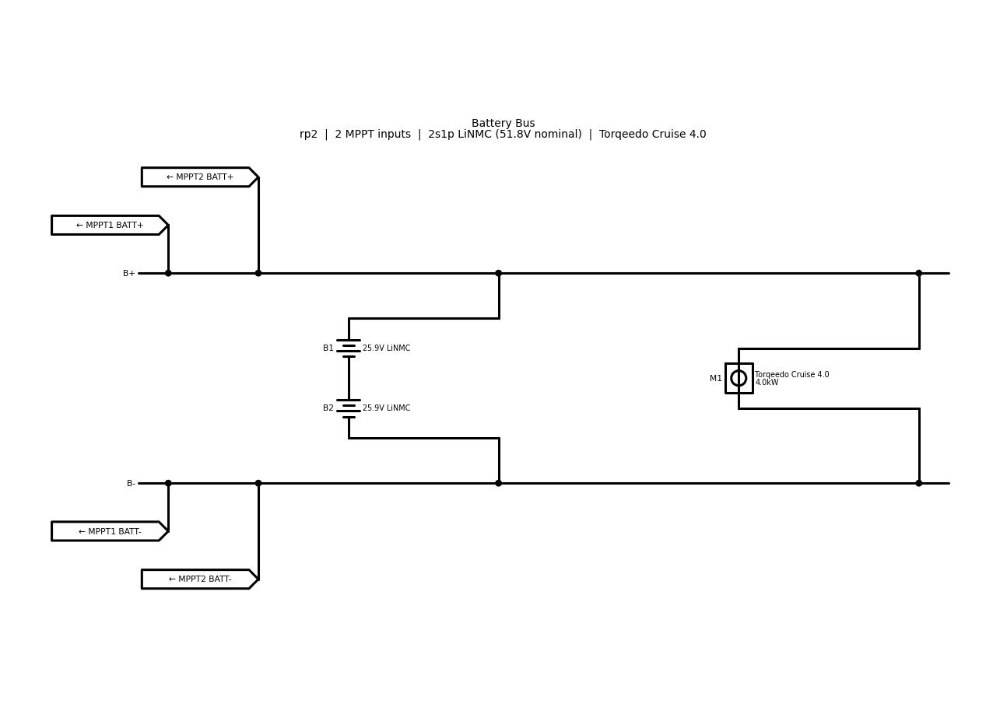
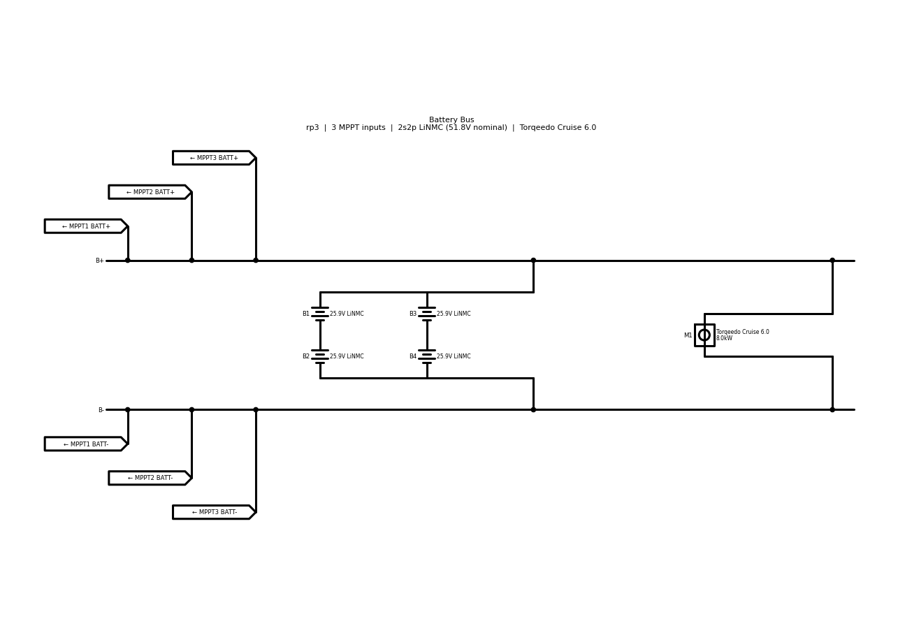

# Electrical Drawing

Generates the multi-page electrical schematic set for a boat from the JSON
configuration in `constant/electrical/`. See [PLAN.md](PLAN.md) for the design
and [SPEC.md](SPEC.md) for the original specification.

## Usage

```sh
make electrical-drawing BOAT=rp2     # one boat
make electrical-drawing-all          # every boat in $(BOATS)
```

Or directly:

```sh
python -m src.electrical_drawing \
    --circuit constant/electrical/boat/rp2/circuit_setup.json \
    --components constant/electrical/components.json \
    --boat-params constant/boat/rp2.json \
    --output artifact/rp2.electrical_drawing
```

Output:

```
artifact/rp2.electrical_drawing/
├── rp2.electrical_drawing.pdf     A4 landscape, one page per drawing
└── pages/
    ├── rp2.mppt1_panel.svg
    ├── rp2.mppt2_panel.svg
    └── rp2.battery_bus.svg
```

One page is produced per MPPT instance (a `config_N` block with `count: 3`
yields three pages), plus one shared battery bus page. Page counts: rp1 and rp2
give 3 pages, rp3 gives 4.

## Example output

An MPPT page — panel array, MPPT, and the two tags handing off to the bus page
(rp2, 2s2p array):



The shared battery bus page for the same boat — two incoming tag pairs, both bus
bars, the 2s1p bank and the load:



The same page for rp3, where the tag stack grows to three pairs and the bank is
2s2p:



## How pages connect

Nets that cross a page boundary are drawn as schemdraw `Tag` elements in matched
pairs, so a reader can follow a net between pages:

| MPPT page | Battery bus page |
| --- | --- |
| `→ Battery Bus B+` | `← MPPT1 BATT+` |
| `→ Battery Bus B-` | `← MPPT1 BATT-` |

## Layout

| Module | Role |
| --- | --- |
| `__main__.py` | CLI entry point |
| `drawing_generator.py` | Orchestrator: config → pages → PDF + SVGs |
| `page_scaler.py` | Fits a drawing to a page, scaling text and line width with it |
| `Array_Creator.py` | Draws series/parallel arrays, returns a `TerminalPair` |
| `components/` | `MPPT`, `Battery`, `Load` elements |
| `drawings/` | Per-page generators and the cross-reference tags |
| `output/pdf_compiler.py` | Multi-page PDF assembly and SVG export |
| `configurations/` | Config parsing and layout constants |
| `demos/` | One runnable demo per implementation task |
| `tests/` | Unit and integration tests |

## Page scaling

Matplotlib sizes geometry in data units but text and line widths in points, so
`page_scaler.scale_to_page()` scales all three by the same ratio; otherwise text
would balloon on large schematics and lines would look hairline on small ones.
`render_to_page()` then draws onto an axes filling a true page-sized figure, with
data limits chosen so one drawing unit maps to exactly the computed scale.

## Tests and demos

```sh
python -m pytest src/electrical_drawing/tests -q
```

Each task has a demo that writes images to
`artifact/electrical_drawing_demos/`:

```sh
python -m src.electrical_drawing.demos.task1_array        # array terminals
python -m src.electrical_drawing.demos.task2_elements     # Battery / Load elements
python -m src.electrical_drawing.demos.task3_mppt_page    # MPPT + panel pages
python -m src.electrical_drawing.demos.task4_battery_bus  # battery bus page
python -m src.electrical_drawing.demos.task5_page_pdf     # scaling + multi-page PDF
python -m src.electrical_drawing.demos.task6_full_set     # end-to-end, all boats
```
